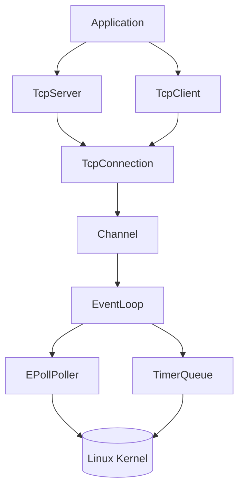
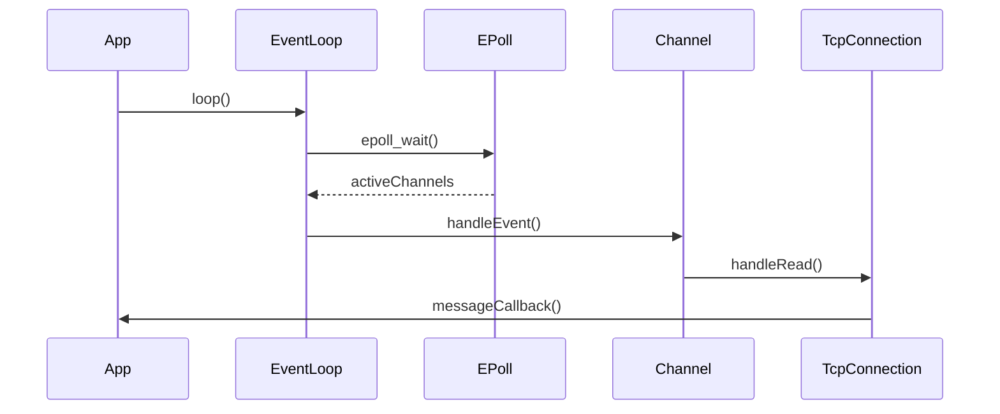
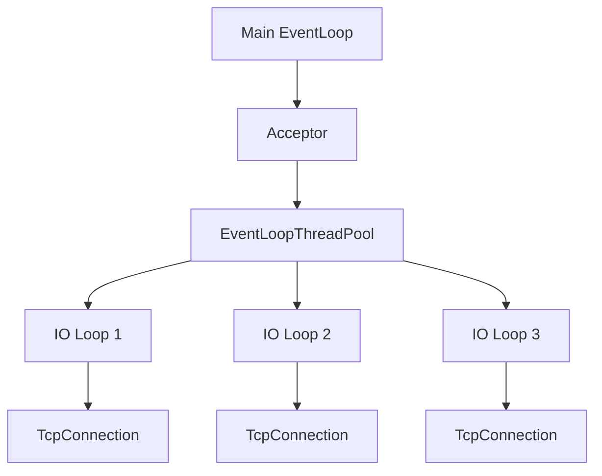
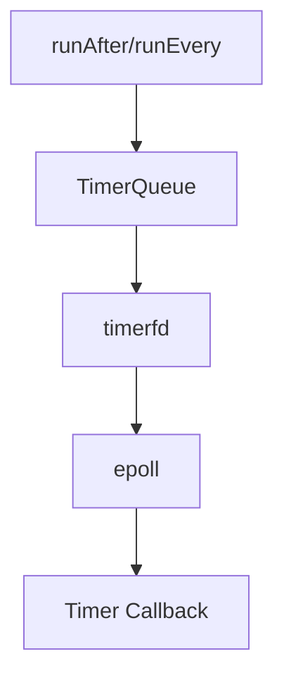
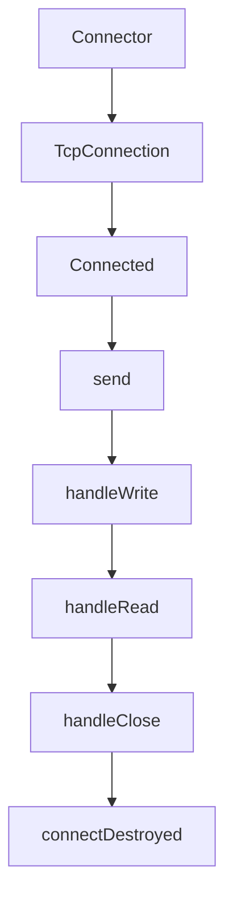

# AgoraIM

A high-performance instant messaging system built with modern C++20.

## Features

- Modern C++20
- CMake
- Linux
- Epoll
- Reactor
- Thread Pool
- MySQL
- Redis

## Build

```bash
mkdir build
cd build
cmake ..
cmake --build .
```

# run
```bash
./agora_server
```

我建议我们直接把 README 做成**可以作为秋招简历配套展示的版本**，而不是普通的课程项目 README。

结合我们整个项目（AgoraNet），下面这个结构是我认为最合适的，也是很多优秀 GitHub C++ 项目的写法。

---

# README 整体框架

```text
README.md
│
├── Logo（后续可加）
├── 项目简介
├── 项目亮点
├── 架构设计
├── 技术栈
├── 核心模块
├── Reactor 工作流程
├── 多线程模型
├── TimerQueue 设计
├── TcpServer / TcpClient 生命周期
├── 项目目录
├── 编译运行
├── Echo 示例
├── Roadmap
├── 致谢
```

---

# 第一部分：项目简介（Overview）

这是整个 README 最重要的一部分。

建议写成下面这种风格：

```markdown
# AgoraNet

AgoraNet 是一个基于 **C++17** 实现的高性能 Reactor 网络库，参考 Muduo 网络库设计，实现了完整的 Reactor 事件驱动模型、多线程事件循环以及高精度定时器系统。

项目底层基于 Linux **epoll + eventfd + timerfd** 构建，支持高并发 TCP Server / TCP Client，并提供 Buffer、TcpConnection、EventLoopThreadPool、TimerQueue 等基础组件。

该项目旨在深入理解 Linux 网络编程、Reactor 模式以及现代 C++ 网络框架设计，同时作为后续 HTTP Server、RPC Framework 等项目的基础设施。
```

这一段一定要体现：

> **不是为了实现 Echo，而是在实现一个网络框架。**

---

# 第二部分：项目亮点

这一节建议直接列出来。

```markdown
## Features

- 基于 epoll 的 Reactor 模型
- EventLoop + Channel + Poller 架构
- One Loop Per Thread 多 Reactor 模型
- TcpServer / TcpClient 双端实现
- 非阻塞 Connector
- 自动 Buffer 管理
- TimerQueue（timerfd）
- runAfter / runEvery / cancel 定时任务
- eventfd 跨线程唤醒机制
- runInLoop / queueInLoop
- 指数退避（Exponential Backoff）自动重连
- Echo Server / Client 示例
```

别人一分钟就知道项目做了什么。

---

# 第三部分：整体架构

这一部分建议放 Mermaid。

GitHub 原生支持。



GitHub 会直接渲染。

这一张图非常重要。

---

# 第四部分：Reactor 工作流程

建议画时序图。



比文字更直观。

---

# 第五部分：线程模型

建议单独放。



很多面试官最喜欢问：

> 为什么是 One Loop Per Thread？

有图之后非常清楚。

---

# 第六部分：TimerQueue

这里建议再放一张图。



说明：

* timerfd
* epoll
* callback

整个流程。

---

# 第七部分：Tcp 生命周期

建议画。



---

# 第八部分：项目目录

例如：

```text
agora/
├── base/
│   ├── logger
│   ├── timestamp
│   ├── current_thread
│   └── noncopyable
│
├── net/
│   ├── channel
│   ├── poller
│   ├── epoll_poller
│   ├── event_loop
│   ├── event_loop_thread
│   ├── event_loop_thread_pool
│   ├── socket
│   ├── buffer
│   ├── acceptor
│   ├── connector
│   ├── tcp_connection
│   ├── tcp_server
│   ├── tcp_client
│   ├── timer
│   ├── timer_queue
│   └── ...
│
examples/
├── echo_server
└── echo_client
```

---

# 第九部分：运行

例如：

```bash
mkdir build
cd build

cmake ..

make -j
```

然后

```bash
./echo_server
```

另一个终端

```bash
./echo_client
```

运行结果：

```text
Server:

UP 127.0.0.1:8888

Echo 23 bytes

DOWN


Client:

Connected

Received: Hello

Disconnected
```

最好附上终端截图。

---

# 第十部分：Roadmap

这个非常重要。

```markdown
## Roadmap

- [x] Reactor
- [x] epoll Poller
- [x] EventLoop
- [x] Buffer
- [x] TcpServer
- [x] TcpClient
- [x] Connector
- [x] TimerQueue
- [x] EventLoopThreadPool
- [ ] HTTP Parser
- [ ] HTTP Server
- [ ] RPC Framework
- [ ] Async Logger
```

这会让项目看起来仍在持续演进。

---

# 第十一部分：Acknowledgement

最后：

```markdown
## Acknowledgement

本项目参考了 Muduo 网络库的整体设计思想，在此基础上采用现代 C++17 进行了重新实现，并结合个人理解完成了 Reactor、TcpServer、TcpClient、TimerQueue 等模块。
```

---

## 我建议的下一步

接下来我们不要一次性把 README 全写完，而是按优秀开源项目的标准逐节打磨。我建议先完成 **第一部分（项目简介）** 和 **第三部分（整体架构图）**，因为这是 GitHub 首页最先展示的内容，也是面试官最先看到的部分。之后再逐步补充各个模块说明、Mermaid 图和运行示例，最终形成一份完整、专业的项目文档。
